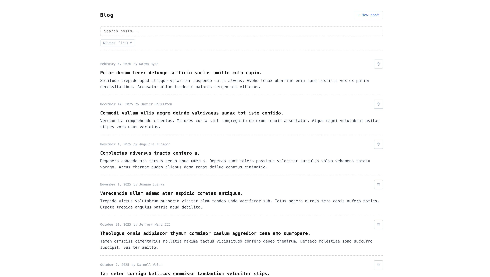
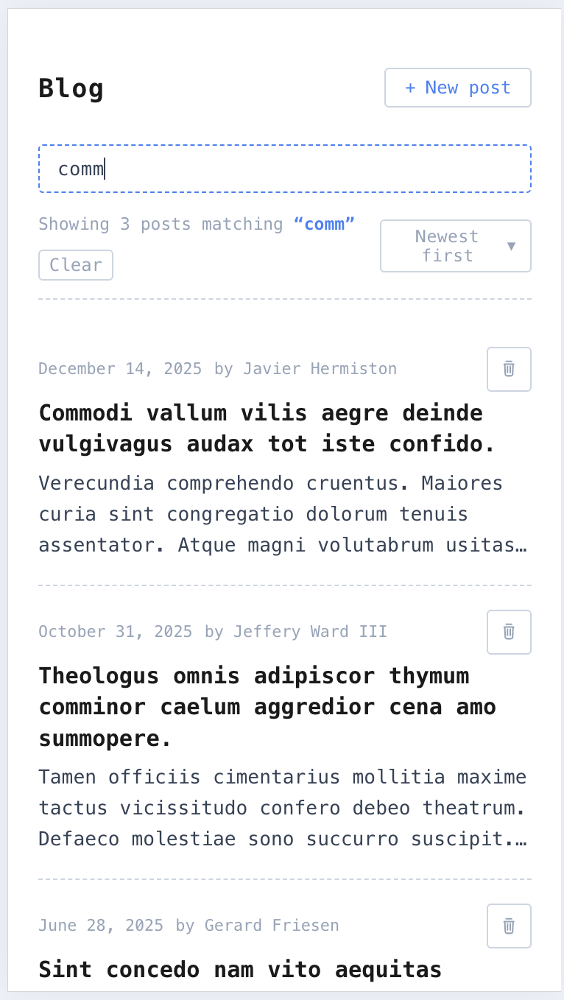

# Blog API Demo

A small React app that fetches blog posts from a public REST API and presents them in a searchable, sortable, paginated list.

Here's what it looks like:





## Quick start

```bash
npm install
npm run dev
```

Open the URL printed in the terminal (usually `http://localhost:5173`).

---

## How the external API is used

The app consumes the blogs category endpoint:

```
GET https://api.mydummyapi.com/categories/blogs
```

This returns a JSON array of blog-post objects:

```json
[
  {
    "id": 1,
    "title": "...",
    "author": "...",
    "content": "...",
    "publishedAt": "2025-03-01T..."
  }
]
```

It also supports write operations for demo purposes:

```
POST   https://api.mydummyapi.com/categories/blogs
DELETE https://api.mydummyapi.com/categories/blogs/:id
```

---

## Features

- Fetch and display blog posts
- Add and delete posts
- Search and sort posts
- Skeleton loading screen
- Responsive on all screen sizes

